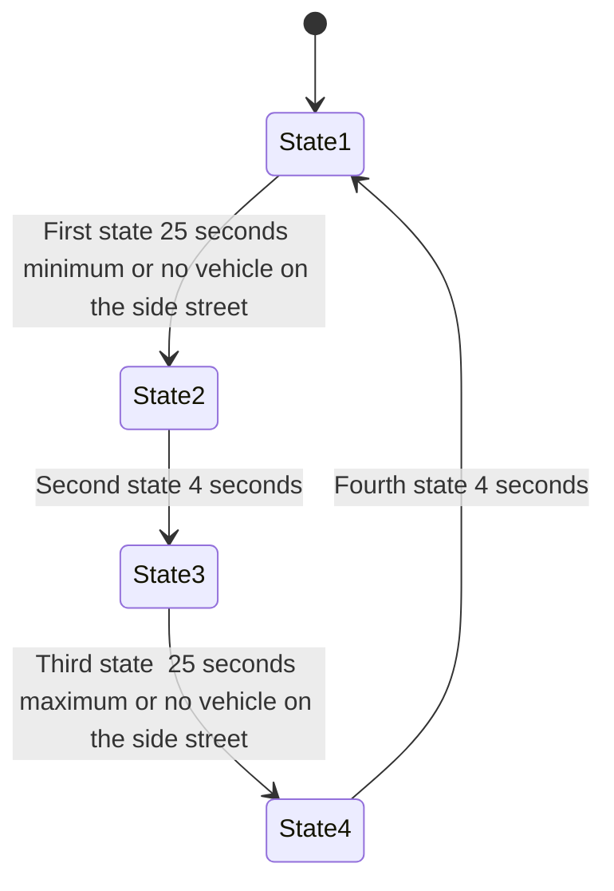
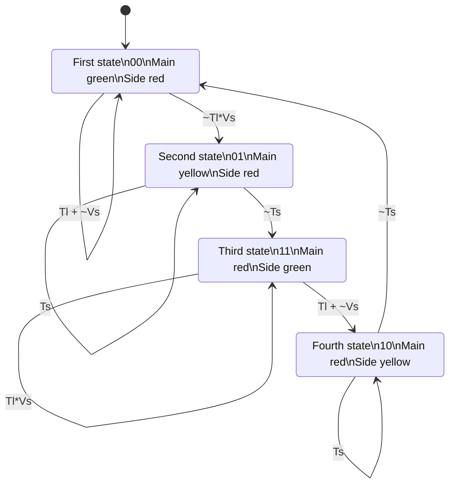

# Traffic-Light
## Traffic light Working
The traffic light works in a fashion that is is described in the mermaid script written.A total four states are defined for the operation of the main traffic light and the side traffic light.

The following parameters have to be kept in mind when the mermaid script has to be understood.

- State1: Main_Trffic_light : **GREEN** ; Side_Traffic_Light : **RED**
- State2: Main_Trffic_light : **Yellow** ; Side_Traffic_Light : **RED**
- State3: Main_Trffic_light : **RED** ; Side_Traffic_Light : **GREEN**
- State4: Main_Trffic_light : **RED*** ; Side_Traffic_Light : **YELLOW**

The timing requirements for the state transition have been described or can be visualized using the mermaid script below.

### State diagram [<a href="https://mermaid.js.org/syntax/stateDiagram.html">docs</a> - <a href="https://mermaid.live/edit#pako:eNpdkEFvgzAMhf8K8nEqpYSNthx22Xbcqcexg0sCiZQQlDhIFeK_L8A6TfXp6fOz9ewJGssFVOAJSbwr7ByadGR1n8T6evpO0vQ1uZDSekOrXGFsPqJPO6q-2-imH8f_0TeHXm50lfelsAMjnEHFY6xpMdRAUhhRQxUlFy0GTTXU_RytYeAx-AdXZB1ULWovdoCB7OXWN1CRC-Ju-r3uz6UtchGHJqDbsPygU57iysb2reoWHpyOWBINvsqypb3vFMlw3TfWZF5xiY7keC6zkpUnZIUojwW-FAVvrvn51LLnvOXHQ84Q5nn-AVtLcwk">live editor</a>]

```
stateDiagram-v2
    [*] --> State1: 
    State1 --> State2: First state 25 seconds minimum or no vehicle on the side street
    State2 --> State3: Second state  4 seconds
    State3 --> State4: Third state  25 seconds maximum or no vehicle on the side street
    State4 --> State1: Fourth state  4 seconds

%%State1: Main_Trffic_light : GREEN ; Side_Traffic_Light : RED
%%State2: Main_Trffic_light : Yellow ; Side_Traffic_Light : RED
%%State3: Main_Trffic_light : RED ; Side_Traffic_Light : GREEN
%%State4: Main_Trffic_light : RED ; Side_Traffic_Light : YELLOW
```


## Traffic Light Implementation

This traffic light can be coded into a Melay Finite State machine using the gray code states. The gray codes are used as is has an advantage of low power transistions in the when used in implementation.The states are named as follows. 
- S0 = 00
- S1 = 01
- S2 = 11
- S3 = 10

Therefore the states can be coded in sequential logic and the transition can take place based on combinational logic. The paramters are:

- Vs - a vehicle is present on the side street
- Tl - The 25s timer (long timer) is ON.
- Ts - THe 4s timer (short timer) is ON.

The FSM state diagram is shown in the code below



The RTL code for the traffic light system can be divided into three parts.
- Sequential Logic - for FSM state definition.
- Combinational logic - to decode and output the FSM output.
- Timing CIrcuit - to define the timing reuirements for the traffic signal.

All of this verilog design codes are used to build the top file of the traffic signal to complete the whole design. The codes can be found in the RTL folder of the Github repositry.

Link : https://github.com/Nipun-S-05/Traffic-Light/tree/main/rtl

The testbench for these design codes are in the testbench folder of the github repositry.

Link: https://github.com/Nipun-S-05/Traffic-Light/tree/main/testbench

